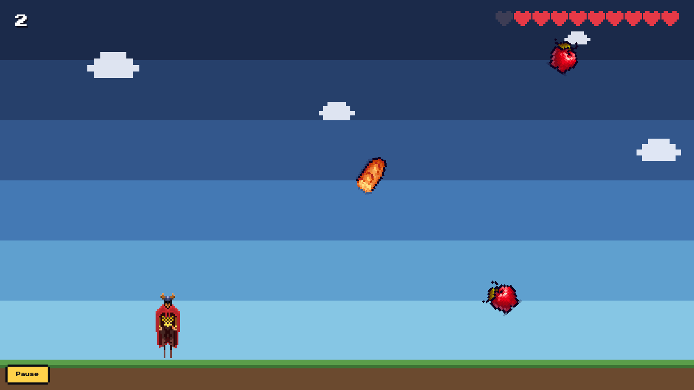
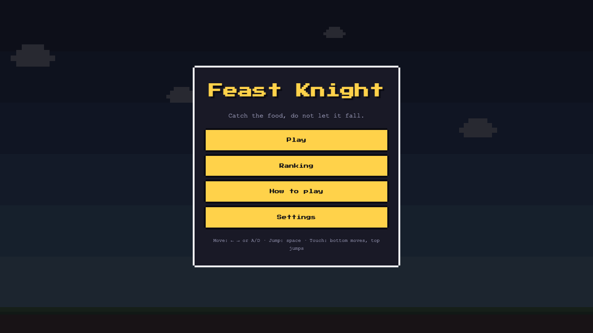
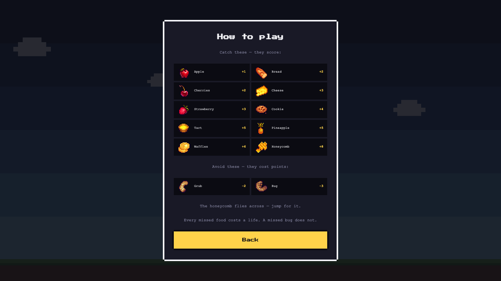
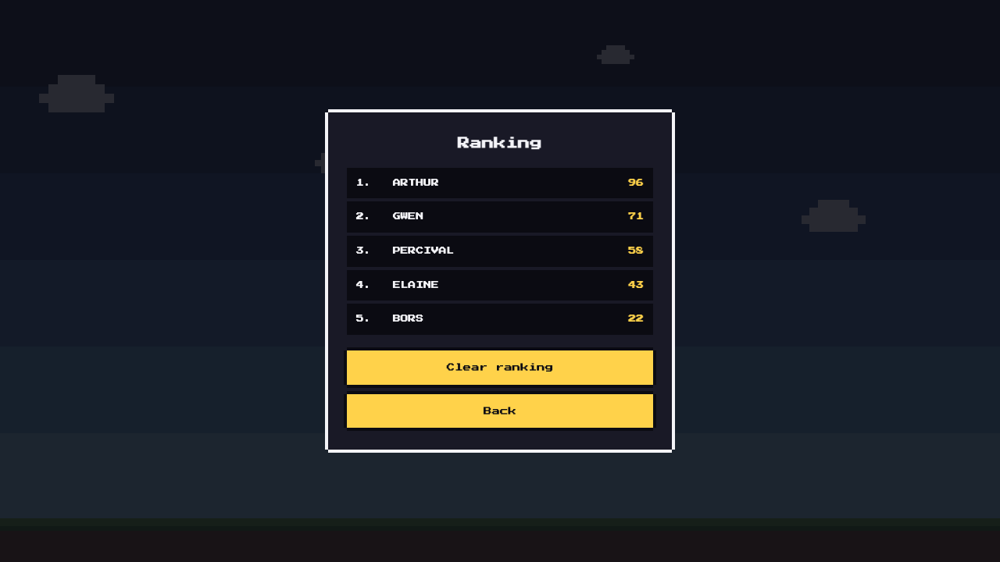
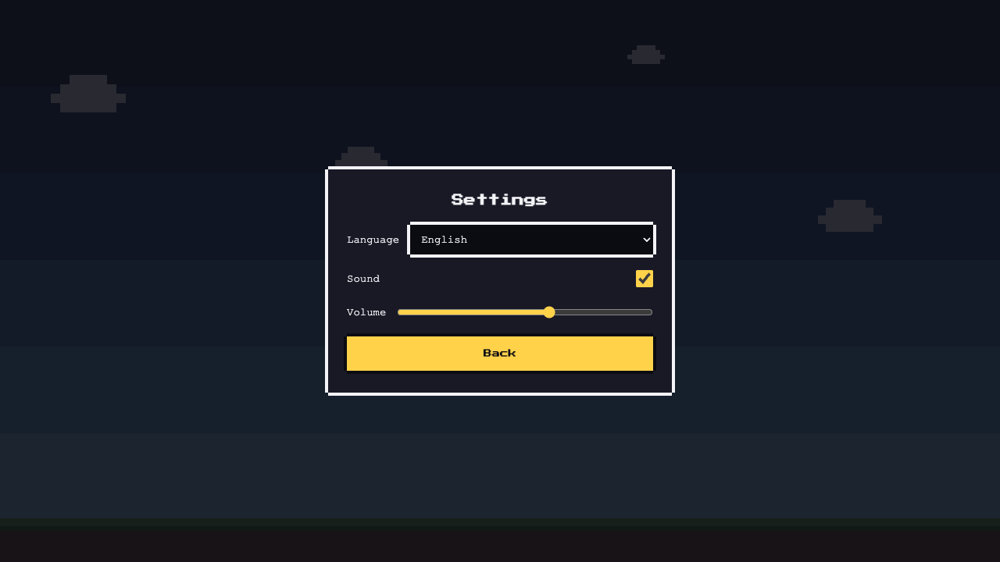
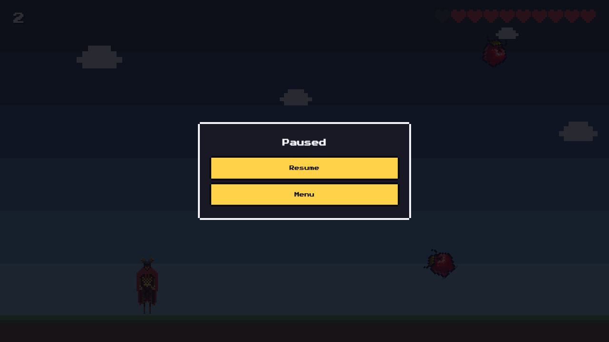
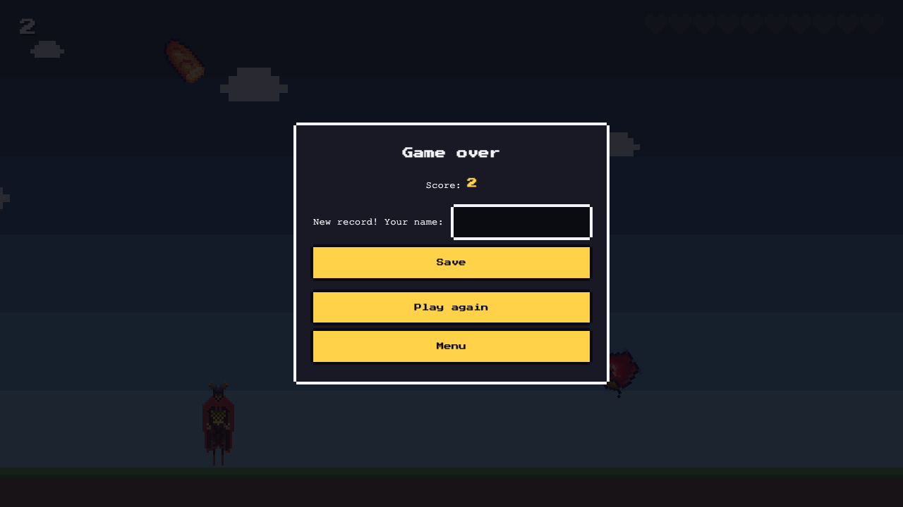

# Feast Knight



An 8-bit catch-the-falling-things game. A starving knight runs along the bottom of the
screen collecting food that drops from above. Every catch scores, every miss costs a life,
and the game ends after ten lives are gone.

## Running it

The project is pinned to the versions from the task description: **Node 16.16.0 LTS /
npm 8.11.0**.

```bash
nvm use && npm install && npm start
```

`npm start` opens the game in a browser. `package-lock.json` was produced by npm 8.11.0
(`lockfileVersion: 2`), so installing on newer npm works too.

| Command             | What it does                   |
| ------------------- | ------------------------------ |
| `npm start`         | development server             |
| `npm run build`     | typecheck + production build   |
| `npm run lint`      | ESLint + the no-comments check |
| `npm run typecheck` | `tsc --noEmit`                 |
| `npm test`          | unit tests (vitest)            |

Every push runs the same steps in GitHub Actions, and a build of `main` is published to
GitHub Pages (`.github/workflows/`). Publishing is enabled once, in the repository
settings: **Settings → Pages → Source: GitHub Actions**.

## Controls

**← →** or **A / D** — move · **space**, **↑** or **W** — jump (60% control in the air)
· **Esc** or **P** — pause · **touch** — the bottom 70% of the screen moves, the top 30%
jumps, and the button in the bottom-left corner pauses

Pausing lets you resume or leave for the menu without losing lives. Game keys are only
captured while a round is running, so the menus stay navigable from the keyboard.

## Gameplay

- ten lives, one lost for every missed item
- five levels: each one shortens the fall time and the gap between spawns, and adds new food
- twelve kinds of food, worth more as they get rarer (apple 1 → honeycomb 8)
- **the grub and the bug subtract points** — do not catch them. A missed grub costs no life,
  because dodging it is the goal rather than a mistake
- the **How to play** screen lists every kind with its value; it opens by itself on a first
  visit and stays reachable from the menu afterwards
- every dozen seconds or so a honeycomb crosses the screen at a height you cannot reach from
  the ground — you have to jump for it
- the top-ten ranking and the sound settings persist in `localStorage`

## Screens

|              Menu              |             How to play              |             Ranking              |
| :----------------------------: | :----------------------------------: | :------------------------------: |
|          |  |      |
|          **Settings**          |              **Paused**              |          **Game over**           |
|  |             |  |

## Architecture

Dependencies point one way, and the boundary is held by ESLint rather than by good
intentions:

```
config/        ──►  (nothing)          the single source of values
game/rules/    ──►  (nothing)          plain TypeScript, ZERO pixi, ZERO config
storage/       ──►  config
core/          ──►  pixi.js, config    input and scaling, knows nothing about the game
game/          ──►  core, rules, config
presentation/  ──►  events, DOM        listens only, never decides
app/           ──►  everything above   the only layer that wires it all together
```

Each of those arrows is a separate `overrides` entry in `.eslintrc.cjs`. An import pointing
the wrong way fails `npm run lint`.

Three consequences follow:

1. **Game rules reach neither the graphics nor the config** — they take their values through
   the constructor. That is why scoring, level progression, collisions, jump physics and the
   "what costs a life" rule are tested without mocks and without a canvas.
2. **Balance is expressed in time, not in pixels.** A level declares `fallSeconds`, the
   player `PLAYER_CROSSING_SECONDS`, the jump `JUMP_APEX_RATIO`, all derived from one shared
   world unit. Difficulty is identical horizontally and vertically, and movement does not
   depend on the frame rate.
3. **The round is orchestrated explicitly** in `PlayScene.update`, while the HUD, particles,
   sound and ranking are subscribers to typed events — adding an effect does not touch game
   logic.

The UI layer is plain DOM: seven screens built on `<template>` and the `hidden` attribute,
no framework. The interface is bilingual (`pl` / `en`), with the language detected from
browser settings and switchable in Settings, together with everything generated at runtime.

### Extending it

| Extension        | Files to touch                                                                                 |
| ---------------- | ---------------------------------------------------------------------------------------------- |
| New kind of food | a file in `src/assets/food/`, `config/items.ts`, `config/levels.ts`, `presentation/strings.ts` |
| New level        | `config/levels.ts` (data only)                                                                 |
| Bomb / power-up  | a new `Entity` subclass + a rule in `ScoreBoard`                                               |
| Online ranking   | swap out `storage/HighScoreStore.ts`                                                           |
| Gamepad support  | `core/InputManager.ts`                                                                         |
| New screen       | a `<section>` in `index.html` + an `Overlay` in the `AppFlow` list                             |
| Balance tweaks   | `config/GameConfig.ts`                                                                         |
| Another language | `config/locales.ts` + `presentation/strings.ts`                                                |

Not one row requires going into `game/rules/`. Sprites are indexed with `import.meta.glob`,
so new artwork needs no import — only a file name matching its kind (`Cheese.png` →
`cheese`).

### Known limitations

- Orientation (portrait / landscape) is picked once, at startup. The game scales to any
  window size, but after rotating a phone you need to reload to get a layout matched to the
  new orientation.
- The ranking and the settings live in one browser's `localStorage` — there is no sync
  between devices.

## Credits

- Character: [4 Directional Character](https://lionheart963.itch.io/4-directional-character) —
  lionheart963. The `idle` and `run left/right` frames (84×84) are used, in `src/assets/knight/`.
- Food: [Free Pixel Food](https://henrysoftware.itch.io/pixel-food) — Henry Software
  (artwork: benmhenry@gmail.com). Twelve 16×16 sprites, in `src/assets/food/`.
- Font: Press Start 2P (Google Fonts, SIL OFL), falling back to the system monospace.

The background, clouds, hearts and particles are drawn procedurally in code — they do not
come from either pack.
