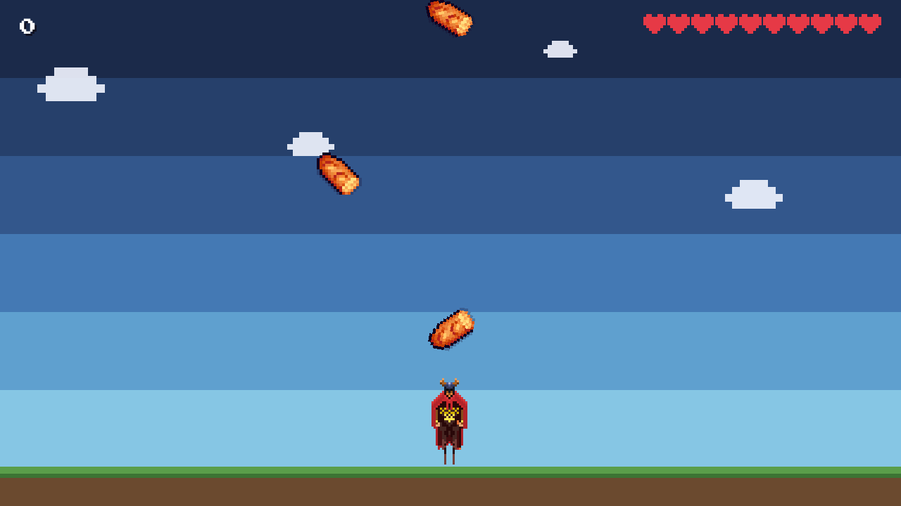

# Feast Knight



Gra typu „łapanie spadających przedmiotów" w stylu 8-bit. Wygłodniały rycerz biega u dołu
ekranu i zbiera jedzenie spadające z góry. Każdy złapany przedmiot daje punkty, każdy
przegapiony odbiera punkt życia. Po utracie dziesięciu żyć gra się kończy.

## Uruchomienie

Projekt jest przypięty do wersji z treści zadania: **Node 16.16.0 LTS / npm 8.11.0**.

```bash
nvm use && npm install && npm start
```

`npm start` otwiera grę w przeglądarce. `package-lock.json` powstał na npm 8.11.0
(`lockfileVersion: 2`), więc instalacja działa też na nowszych wersjach npm.

| Polecenie           | Działanie                          |
| ------------------- | ---------------------------------- |
| `npm start`         | serwer deweloperski                |
| `npm run build`     | typecheck + build produkcyjny      |
| `npm run lint`      | ESLint + kontrola braku komentarzy |
| `npm run typecheck` | `tsc --noEmit`                     |
| `npm test`          | testy jednostkowe (vitest)         |

Każdy push uruchamia te same kroki w GitHub Actions, a build z `main` ląduje na GitHub Pages
(`.github/workflows/`). Publikację włącza się raz, w ustawieniach repozytorium:
**Settings → Pages → Source: GitHub Actions**.

## Sterowanie

**← →** lub **A / D** — ruch · **spacja**, **↑** lub **W** — skok (w locie 60% kontroli)
· **Esc** lub **P** — pauza · **dotyk** — dolne 70% ekranu rusza, górne 30% skacze,
przycisk w lewym dolnym rogu pauzuje

Z pauzy można wrócić do gry albo wyjść do menu, nie tracąc żyć. Klawisze gry są przechwytywane
tylko w trakcie rozgrywki, więc w menu i ustawieniach działa zwykła nawigacja z klawiatury.

## Rozgrywka

- 10 żyć, punkt życia za każdy przegapiony przedmiot
- pięć poziomów: każdy skraca czas lotu przedmiotu i odstęp między spawnami oraz dokłada
  nowe jedzenie
- dwanaście rodzajów jedzenia; wartość rośnie z rzadkością (jabłko 1 → plaster miodu 8)
- **larwa i robak odbierają punkty** — ich nie łap. Przegapiona larwa nie kosztuje życia,
  bo omijanie ich jest celem, a nie błędem
- ekran **Jak grać** pokazuje wszystkie rodzaje z ich wartością; przy pierwszym uruchomieniu
  otwiera się sam, potem jest dostępny z menu
- co kilkanaście sekund w poprzek ekranu przelatuje plaster miodu na wysokości nie do
  sięgnięcia z ziemi — trzeba po niego wyskoczyć
- ranking top 10 i ustawienia dźwięku zapisują się w `localStorage`

## Architektura

Zależności idą w jedną stronę, a granicy pilnuje ESLint, nie dobre chęci:

```
config/        ──►  (nic)              jedyne źródło wartości
game/rules/    ──►  (nic)              czysty TypeScript, ZERO pixi, ZERO configu
storage/       ──►  config
core/          ──►  pixi.js, config    wejście i skalowanie, nic o grze nie wie
game/          ──►  core, rules, config
presentation/  ──►  zdarzenia, DOM     tylko słucha, nigdy nie decyduje
app/           ──►  wszystko powyżej   jedyne miejsce, które składa całość
```

Każda z tych strzałek jest osobnym `overrides` w `.eslintrc.cjs`. Import w złą stronę nie
przechodzi `npm run lint`.

Trzy decyzje, które z tego wynikają:

1. **Reguły gry nie mają dostępu do grafiki ani do configu** — dostają wartości przez
   konstruktor. Dlatego punktacja, progresja poziomów, kolizje, fizyka skoku i zasada
   „co kosztuje życie" mają testy bez mocków i bez canvasa.
2. **Balans zapisany w czasie, nie w pikselach.** Poziom deklaruje `fallSeconds`, gracz
   `PLAYER_CROSSING_SECONDS`, skok `JUMP_APEX_RATIO` liczone od wspólnej jednostki świata.
   Trudność jest identyczna w poziomie i w pionie, a ruch nie zależy od liczby klatek.
3. **Rozgrywka orkiestrowana jawnie** w `PlayScene.update`, a HUD, cząsteczki, dźwięk
   i ranking to subskrybenci typowanych zdarzeń — dodanie efektu nie dotyka logiki gry.

Warstwa UI to czysty DOM: siedem ekranów na `<template>` i atrybucie `hidden`, bez frameworka.
Interfejs jest dwujęzyczny (`pl` / `en`) — język wykrywany z ustawień przeglądarki i
przełączalny w Ustawieniach, razem z całą zawartością generowaną dynamicznie.

### Jak to rozwijać

| Rozszerzenie         | Pliki do zmiany                                                                             |
| -------------------- | ------------------------------------------------------------------------------------------- |
| Nowy rodzaj jedzenia | plik w `src/assets/food/`, `config/items.ts`, `config/levels.ts`, `presentation/strings.ts` |
| Nowy poziom          | `config/levels.ts` (same dane)                                                              |
| Bomba / power-up     | nowa podklasa `Entity` + reguła w `ScoreBoard`                                              |
| Ranking online       | podmiana `storage/HighScoreStore.ts`                                                        |
| Sterowanie padem     | `core/InputManager.ts`                                                                      |
| Nowy ekran           | `<section>` w `index.html` + `Overlay` na liście w `AppFlow`                                |
| Zmiana balansu       | `config/GameConfig.ts`                                                                      |
| Kolejny język        | `presentation/strings.ts`                                                                   |

Żaden wiersz nie wymaga wejścia w `game/rules/`. Sprite'y są indeksowane przez
`import.meta.glob`, więc nowa grafika nie wymaga dopisywania importu — wystarczy nazwa pliku
zgodna z rodzajem (`Cheese.png` → `cheese`).

### Znane ograniczenia

- Orientacja (pion / poziom) jest wybierana raz, przy starcie. Gra skaluje się do każdego
  rozmiaru okna, ale po obrocie telefonu trzeba odświeżyć stronę, żeby dostać układ
  dopasowany do nowej orientacji.
- Ranking i ustawienia żyją w `localStorage` jednej przeglądarki — nie ma synchronizacji
  między urządzeniami.

## Materiały

- Postać: [4 Directional Character](https://lionheart963.itch.io/4-directional-character) —
  lionheart963. Wykorzystane klatki `idle` i `run left/right` (84×84), w `src/assets/knight/`.
- Jedzenie: [Free Pixel Food](https://henrysoftware.itch.io/pixel-food) — Henry Software
  (grafika: benmhenry@gmail.com). Dwanaście sprite'ów 16×16, w `src/assets/food/`.
- Czcionka: Press Start 2P (Google Fonts, SIL OFL), fallback systemowy monospace.

Tło, chmury, serca i cząsteczki są rysowane proceduralnie w kodzie — nie pochodzą z paczek.
